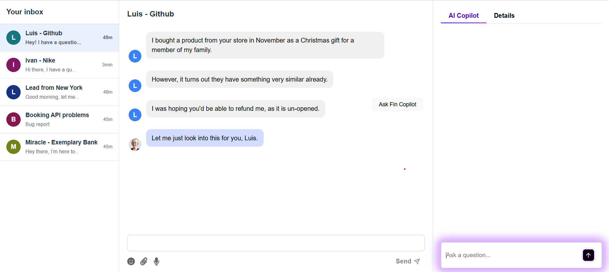
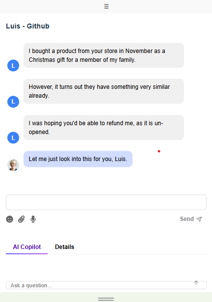
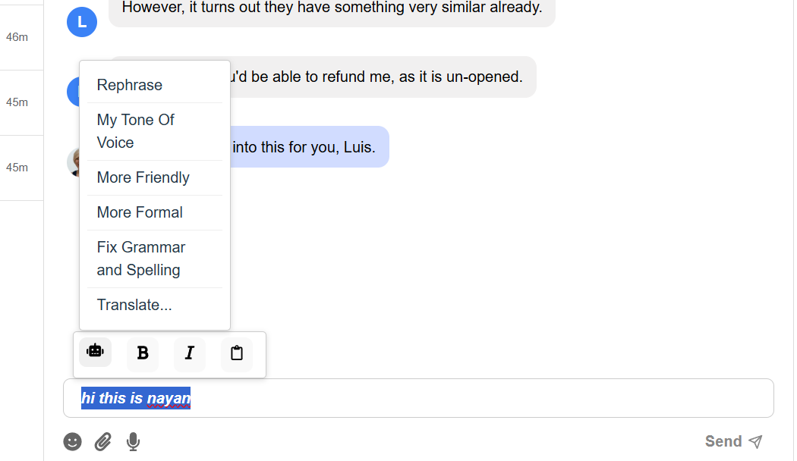

# AI Copilot-Enabled Customer Service Chat App

## Live Demo

Check out the live version of this app here:  
[live link](https://customer-support-window-gaci.vercel.app/)

---

## Project Overview

This React-based project simulates an AI Copilot-enabled customer service chat interface. It offers a responsive, interactive, and user-friendly experience, mimicking real-time conversations between a user and AI-powered support.

---

## Features

- **Three Main Sections:**  
  - **Sidebar:** Displays contacts (hidden on mobile, accessible via a toggle button).  
  - **Chat Window:** Main conversation area with rich-text chat input and formatted messages.  
  - **AI Copilot:** AI-powered assistant that generates dynamic responses using predefined dummy data and randomization.

- **Responsive Design:**  
  - Fully responsive layout adapts to desktops, tablets, and mobile devices.  
  - On mobile, the sidebar collapses into a toggle button for contacts, maximizing screen space.

- **Interactive Chat:**  
  - Rich text input with formatting options (bold, italic, copy to clipboard).  
  - Messages can be added from the chat window to AI Copilot input and vice versa by clicking a button.  
  - Smooth animations enhance user experience.

- **Dummy Data & Simulated AI:**  
  - Uses predefined conversations stored in JavaScript files.  
  - AI Copilot responses are randomly generated from dummy responses for demo purposes.

---

## Screenshots

### Desktop View  
  
*Shows full sidebar, chat window, and AI Copilot panel.*

### Mobile View  
  
*Sidebar collapsed into a toggle button, chat and AI Copilot stacked vertically.*

### Chat Input Formatting  
  
*Rich text formatting toolbar visible when typing.*

---

## Tech Stack

- React  
- TipTap (Rich Text Editor)  
- React Icons  
- CSS for responsive design and animations

---

